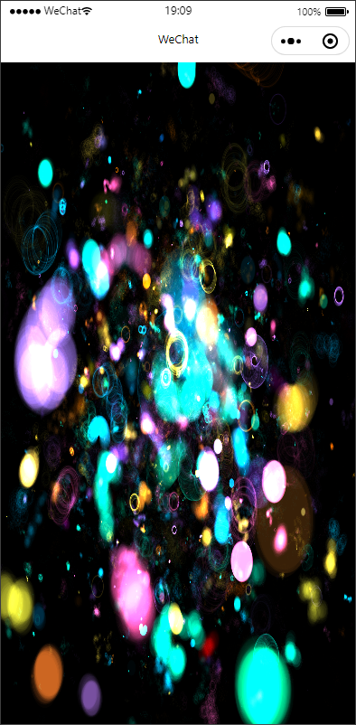
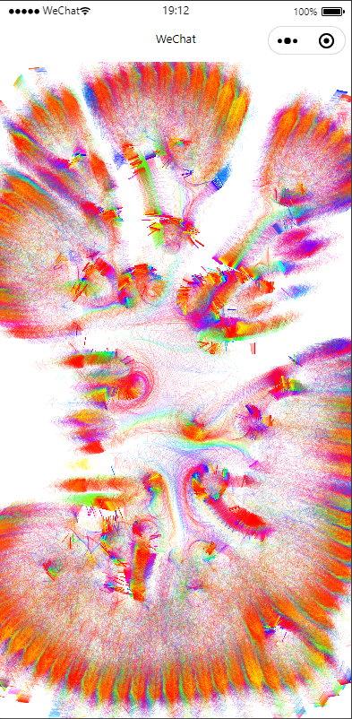
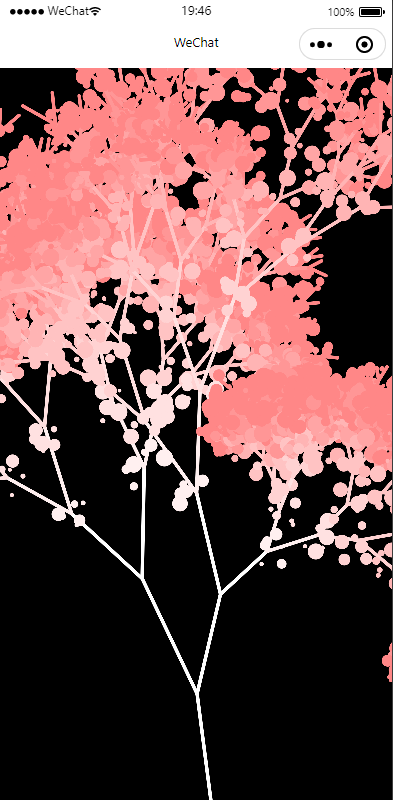
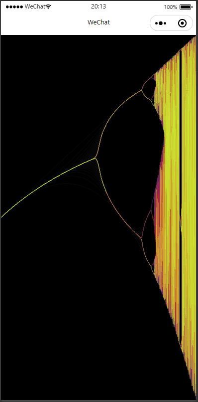

# p5js 小程序 的适配版本。

## 实现的功能
- 支持2d下的 微信小程序 适配，**注意是微信小程序不是微信小游戏**
- 支持p5的touch事件事件处理

## 原理
由于微信程序不支持window，document 等dom操作，参考[微信文档Adapter说明](https://developers.weixin.qq.com/minigame/dev/guide/best-practice/adapter.html)，结合[weapp-p5js-adapter](https://github.com/avantcontra/p5.we/tree/master/libs/weapp-p5js-adapter) 和 [createJs-miniprogram](https://github.com/skyfish-qc/createJs-miniprogram/tree/master/src) ；在微信小程序中实现dom等操作。当然，由于微信小程序的现在，仅部分可以在p5上使用的功能，达到如下图效果

## 效果图

以下是适配后在微信小程序的样例展示，详见example中的pages中 `test{n}.js` 相关代码
<div>
    
    
    
    
</div>

## 使用

可参考 example 目录下的示例项目或参照以下流程：

1. 打包 p5js.adapter.js
```shell
    npm install
    npm run build
```
1. 复制dist目录的p5js.adapter.js到微信小程序的目录libs下
2. 导入小程序适配版本的 p5js， 参考如下代码
```javascript
    const createP5JS = require("../../libs/p5js.adapter").createP5JS
    var gloabal = {};
    var window = {}, document = {}, canvas = {};
    var p5js = {};
    let sysInfo = wx.getSystemInfoSync();
    let windowWidth = sysInfo.windowWidth;
    let windowHeight = sysInfo.windowHeight;
    var app = getApp()
    Page({
        onLoad: function () {
            var query2d = wx.createSelectorQuery();
            query2d.select('#defaultCanvas0').fields({ node: true, size: true }).exec((res2d) => {
                var canvas2d = res2d[0].node;
                canvas2d.id = "defaultCanvas0"
                gloabal = createP5JS(canvas2d);
                document = gloabal.document
                canvas = gloabal.canvas
                window = gloabal.window
                window.canvas = canvas
                gloabal.screen = window.screen
                console.log(window, document, canvas)

                // 需要的时候加载p5的包，此处通过p5js.adapter 模拟出的 gloabal 传入p5.js
                // 实现其中的dom操作方法
                var p5 = require('../../libs/p5.min')(gloabal)
                console.log("psjs", p5js)
                // https://github.com/processing/p5.js/wiki/Global-and-instance-mode#when-is-global-mode-assumed
                const s = (sketch) => {
                    // 此处写p5的代码
                    // 针对p5的内置变量，全部从sketch里获取
                    let pa = [], gr = 2, pindex = 1, chue = -23;

                    sketch.setup = () => {
                        sketch.createCanvas(windowWidth, windowHeight);

                        sketch.background(0);
                        sketch.colorMode(sketch.HSB);

                        for (let i = 0; i < 2010; i++) pa.push([0.5]);
                    }

                    sketch.draw = () => {
                        for (let i = 0; i < 20; i++) {
                            sketch.colorMode(sketch.HSB)
                            let scol = sketch.color(chue, 80, 100);
                            scol.setAlpha(0.5);
                            sketch.stroke(scol);
                            let ind = sketch.round(1000 * (gr - 2));
                            pa[ind].push(pa[ind][pindex - 1] * gr * (1 - pa[ind][pindex - 1]))
                            if (ind > 0) {
                                sketch.line(
                                    sketch.round(sketch.map(gr - 0.001, 2, 4, 0, sketch.width)),
                                    sketch.round(sketch.map(pa[ind - 1][pindex], 0, 1, sketch.height, 0)),
                                    sketch.round(sketch.map(gr, 2, 4, 0, sketch.width)),
                                    sketch.round(sketch.map(pa[ind][pindex], 0, 1, sketch.height, 0)),
                                );
                            }
                            gr += 0.001;
                            if (gr >= 4) {
                                gr = 2;
                                pindex++;
                                chue += 23;
                                chue %= 360;
                                sketch.colorMode(sketch.RGB)
                                sketch.background(0, 0, 0, 20);
                            }
                        }
                    }
                };
                p5js = new p5(s);
                p5js.dispatchEvent = function (event) {
                    // console.log(event.touches[0])
                    class TouchEvent {
                        target = ""
                        currentTarget = ""
                        touches = []
                        targetTouches = []
                        changedTouches = []
                        preventDefault = function () { }
                        stopPropagation = function () { }
                        constructor(type) {
                            this.type = type
                        }
                    }
                    var ratio = 1;
                    const touchEvent = new TouchEvent(event.type)
                    for (var i = 0; i < event.touches.length; i++) {
                        event.touches[i].clientX = event.touches[i].x * ratio;
                        event.touches[i].clientY = event.touches[i].y * ratio;
                        event.touches[i].layerX = event.touches[i].x * ratio;
                        event.touches[i].layerY = event.touches[i].y * ratio;
                        event.touches[i].pageX = event.touches[i].x * ratio;
                        event.touches[i].pageY = event.touches[i].y * ratio;
                    }
                    for (var i = 0; i < event.changedTouches.length; i++) {
                        event.changedTouches[i].clientX = event.changedTouches[i].x * ratio;
                        event.changedTouches[i].clientY = event.changedTouches[i].y * ratio;
                        event.changedTouches[i].layerX = event.changedTouches[i].x * ratio;
                        event.changedTouches[i].layerY = event.changedTouches[i].y * ratio;
                        event.changedTouches[i].pageX = event.changedTouches[i].x * ratio;
                        event.changedTouches[i].pageY = event.changedTouches[i].y * ratio;
                    }
                    touchEvent.target = canvas
                    touchEvent.touches = event.touches
                    touchEvent.targetTouches = Array.prototype.slice.call(event.touches)
                    touchEvent.changedTouches = event.changedTouches
                    touchEvent.timeStamp = event.timeStamp
                    window.dispatchEvent(touchEvent)
                }
            });
        },
        touchEvent: function (e) {
            p5js.dispatchEvent(e);
        }
    })
```

## 说明

1. 本项目当前使用的 p5js 版本号为 1.4.1。
2. 本项目适配仅支持 canvas 2d，对webgl支持存在问题，后面有时间处理
3. 微信小程序的canvas是微信基于原生canvas在上层做的适配处理，在性能上比微信小游戏查不少，微信小游戏是基于原生实现（不完全适配原生）
4. 由于第3条的原因，在渲染大量元素时，存在卡顿掉帧，所以该项目仅仅是一种p5的适配展示，仅个人兴趣使然。